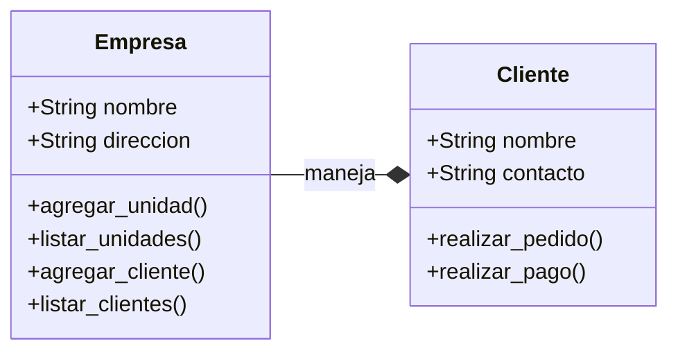
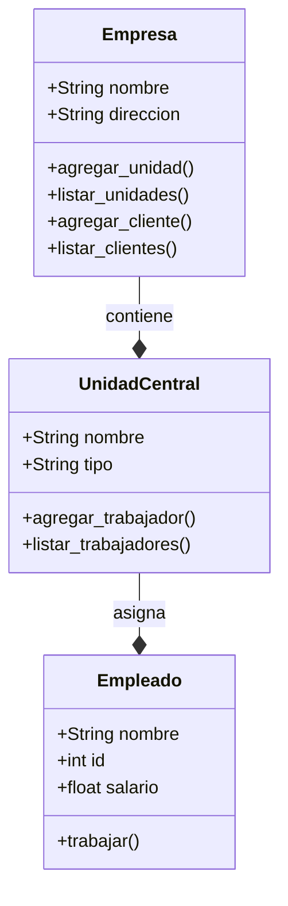
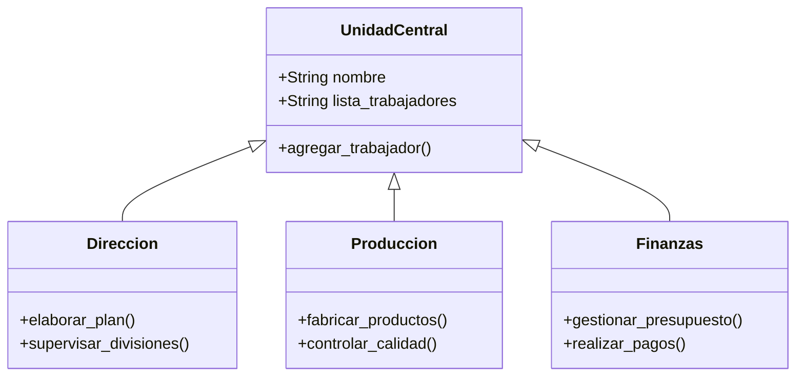
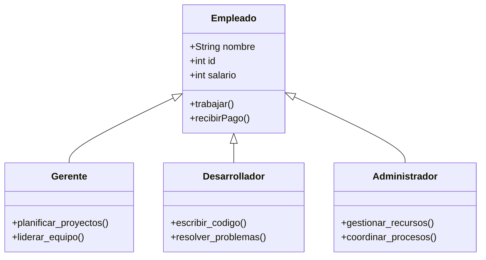
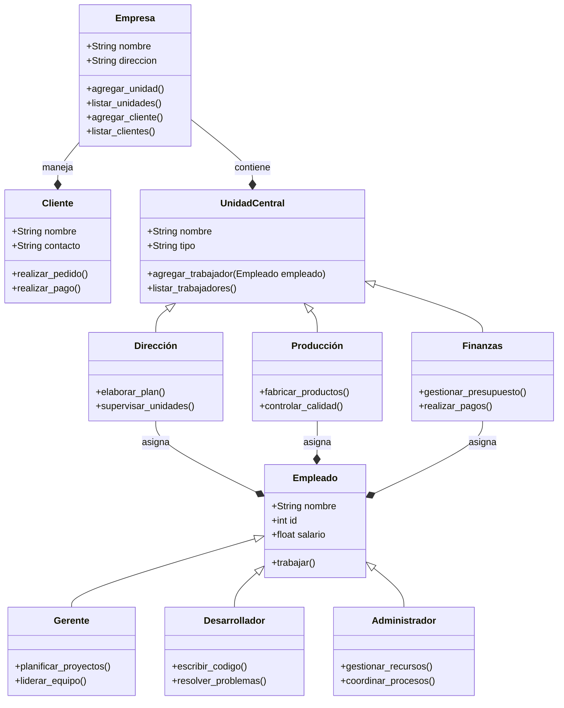

# Reto 2

## Estudiante: `Santiago Gamboa Martínez`

### Ejercicio:

Descripción del Reto

Desarrolle la mayoría de ejercicios en clase. Para cada punto cree un programa individual. Al finalizar suba todo a un repo y súbalo al canal reto_2 en slack.

1. Elija un problema de la vida real (sistema de gestión de biblioteca, negocio de compra-venta, automóvil, etc) que se pueda modelar a través de objetos y clases. Plantee las relaciones de clases, composiciones, propiedades y comportamientos del sistema en uno mas diagramas tipo UML.

---

El siguiente modelo estpa basado en la **estructura de una empresa de desarroollo de software**, siguiendo los puntos esenciales de relaciones entre clases, composiciones, propiedades y comportamientos en diagramas UML usando Mermaid.

### Relación Cliente - Empresa

El cliente se relaciona directamente con la empresa, y esta relación puede incluir:

**Empresa**: Es la clase principal que contiene las atributos generales y métodos para gestionar las unidades que forman parte de ella y los clientes.

- Relación: La empresa maneja una lista de clientes y proporciona servicios a través de métodos específicos.

**Atributos del cliente**: Identidad, necesidades específicas y datos de contacto.

**Acciones del cliente**: Solicita servicios o realiza pagos.

### Relación Empresa - Unidad Central - Empleados

**Empresa**: Es la clase principal que contiene las atributos generales y métodos para gestionar las unidades que forman parte de ella.

- Relación: La clase `Empresa` tiene a la unidad central, lo que está modelado con una composición (--\*).

**Unidad**: Representa la unidad donde se parten las divisiones o áreas de la empresa. Sin embargo, cada división tiene su propio nombre y tipo.

- Relación: La unidad asigna empleados y tiene a la clase `Empleado`.

**Empleado**: Es la base de todos los roles dentro de la empresa, con atributos esenciales (nombre, id, salario) y un método general para realizar su tarea principal (trabajar()).

## Relación entre las Divisiones - Unidad Central

**Relación con Unidad**: Las divisiones _Dirección_, _Producción_ y _Finanzas_ son especializaciones de la clase Unidad Central y heredan sus propiedades y métodos.

- Ejemplo: Todas las divisiones tienen un nombre y pueden listar_trabajadores() o agregar_trabajador()

**Funciones específicas**:

- Dirección: Se encarga de tareas estratégicas (elaborar_plan) y supervisa las otras unidades (supervisar_unidades).

- Producción: Maneja el desarrollo de productos (fabricar_productos) y garantiza la calidad (controlar_calidad).

- Finanzas: Administra los recursos financieros de la empresa (gestionar_presupuesto y realizar_pagos).

## Relaciones entre roles - Jerarquía de roles de empleados

**Relación con Empleado**: Es la clase padre de la cual derivan roles específicos como _Gerente_, _Desarrollador_ y _Administrador_. Por lo tanto, cada rol hereda los atributos y métodos de la clase Empleado.

- Herencia: Los roles de los empleados heredan las propiedades (nombre, id, salario) y métodos (trabajar()) de Empleado.

**Descripción de los Roles**:

- Gerente: Se centra en la planificación y liderazgo (planificar_proyectos y liderar_equipo).

- Desarrollador: Realiza el trabajo técnico de la empresa, como programar (escribir_codigo) y resolver errores (resolver_problemas).

- Administrador: Gestiona los recursos internos de la empresa (gestionar_recursos) y coordina las operaciones (coordinar_procesos).

## Diagrama completo

